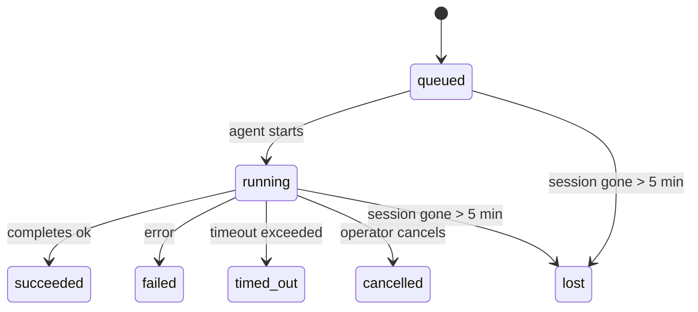

# Background Tasks

> **Looking for scheduling?** See [Automation & Tasks](/automation) for choosing the right mechanism. This page covers **tracking** background work, not scheduling it.

Background tasks track work that runs **outside your main conversation session**:
ACP runs, subagent spawns, isolated cron job executions, and CLI-initiated operations.

Tasks do **not** replace sessions, cron jobs, or heartbeats — they are the **activity ledger** that records what detached work happened, when, and whether it succeeded.

<Note>
Not every agent run creates a task. Heartbeat turns and normal interactive chat do not. All cron executions, ACP spawns, subagent spawns, and CLI agent commands do.
</Note>

## TL;DR

- Tasks are **records**, not schedulers — cron and heartbeat decide _when_ work runs, tasks track _what happened_.
- ACP, subagents, all cron jobs, and CLI operations create tasks. Heartbeat turns do not.
- Each task moves through `queued → running → terminal` (succeeded, failed, timed_out, cancelled, or lost).
- Cron tasks stay live while the cron runtime still owns the job; chat-backed CLI tasks stay live only while their owning run context is still active.
- Completion is push-driven: detached work can notify directly or wake the
  requester session/heartbeat when it finishes, so status polling loops are
  usually the wrong shape.
- Isolated cron runs and subagent completions best-effort clean up tracked browser tabs/processes for their child session before final cleanup bookkeeping.
- Isolated cron delivery suppresses stale interim parent replies while
  descendant subagent work is still draining, and it prefers final descendant
  output when that arrives before delivery.
- Completion notifications are delivered directly to a channel or queued for the next heartbeat.
- `openclaw tasks list` shows all tasks; `openclaw tasks audit` surfaces issues.
- Terminal records are kept for 7 days, then automatically pruned.

## Quick start

```bash
# List all tasks (newest first)
openclaw tasks list

# Filter by runtime or status
openclaw tasks list --runtime acp
openclaw tasks list --status running

# Show details for a specific task (by ID, run ID, or session key)
openclaw tasks show <lookup>

# Cancel a running task (kills the child session)
openclaw tasks cancel <lookup>

# Change notification policy for a task
openclaw tasks notify <lookup> state_changes

# Run a health audit
openclaw tasks audit

# Preview or apply maintenance
openclaw tasks maintenance
openclaw tasks maintenance --apply

# Inspect TaskFlow state
openclaw tasks flow list
openclaw tasks flow show <lookup>
openclaw tasks flow cancel <lookup>
```

## What creates a task

| Source                 | Runtime type | When a task record is created                          | Default notify policy |
| ---------------------- | ------------ | ------------------------------------------------------ | --------------------- |
| ACP background runs    | `acp`        | Spawning a child ACP session                           | `done_only`           |
| Subagent orchestration | `subagent`   | Spawning a subagent via `sessions_spawn`               | `done_only`           |
| Cron jobs (all types)  | `cron`       | Every cron execution (main-session and isolated)       | `silent`              |
| CLI operations         | `cli`        | `openclaw agent` commands that run through the gateway | `silent`              |
| Agent media jobs       | `cli`        | Session-backed `video_generate` runs                   | `silent`              |

Main-session cron tasks use `silent` notify policy by default — they create records for tracking but do not generate notifications. Isolated cron tasks also default to `silent` but are more visible because they run in their own session.

Session-backed `video_generate` runs also use `silent` notify policy. They still create task records, but completion is handed back to the original agent session as an internal wake so the agent can write the follow-up message and attach the finished video itself. If you opt into `tools.media.asyncCompletion.directSend`, async `music_generate` and `video_generate` completions try direct channel delivery first before falling back to the requester-session wake path.

While a session-backed `video_generate` task is still active, the tool also acts as a guardrail: repeated `video_generate` calls in that same session return the active task status instead of starting a second concurrent generation. Use `action: "status"` when you want an explicit progress/status lookup from the agent side.

**What does not create tasks:**

- Heartbeat turns — main-session; see [Heartbeat](/gateway/heartbeat)
- Normal interactive chat turns
- Direct `/command` responses

## Task lifecycle



| Status      | What it means                                                              |
| ----------- | -------------------------------------------------------------------------- |
| `queued`    | Created, waiting for the agent to start                                    |
| `running`   | Agent turn is actively executing                                           |
| `succeeded` | Completed successfully                                                     |
| `failed`    | Completed with an error                                                    |
| `timed_out` | Exceeded the configured timeout                                            |
| `cancelled` | Stopped by the operator via `openclaw tasks cancel`                        |
| `lost`      | The runtime lost authoritative backing state after a 5-minute grace period |

Transitions happen automatically — when the associated agent run ends, the task status updates to match.

`lost` is runtime-aware:

- ACP tasks: backing ACP child session metadata disappeared.
- Subagent tasks: backing child session disappeared from the target agent store.
- Cron tasks: the cron runtime no longer tracks the job as active.
- CLI tasks: isolated child-session tasks use the child session; chat-backed CLI tasks use the live run context instead, so lingering channel/group/direct session rows do not keep them alive.

## Delivery and notifications

When a task reaches a terminal state, OpenClaw notifies you. There are two delivery paths:

**Direct delivery** — if the task has a channel target (the `requesterOrigin`), the completion message goes straight to that channel (Telegram, Discord, Slack, etc.). For subagent completions, OpenClaw also preserves bound thread/topic routing when available and can fill a missing `to` / account from the requester session's stored route (`lastChannel` / `lastTo` / `lastAccountId`) before giving up on direct delivery.

**Session-queued delivery** — if direct delivery fails or no origin is set, the update is queued as a system event in the requester's session and surfaces on the next heartbeat.

<Tip>
Task completion triggers an immediate heartbeat wake so you see the result quickly — you do not have to wait for the next scheduled heartbeat tick.
</Tip>

That means the usual workflow is push-based: start detached work once, then let
the runtime wake or notify you on completion. Poll task state only when you
need debugging, intervention, or an explicit audit.

### Notification policies

Control how much you hear about each task:

| Policy                | What is delivered                                                       |
| --------------------- | ----------------------------------------------------------------------- |
| `done_only` (default) | Only terminal state (succeeded, failed, etc.) — **this is the default** |
| `state_changes`       | Every state transition and progress update                              |
| `silent`              | Nothing at all                                                          |

Change the policy while a task is running:

```bash
openclaw tasks notify <lookup> state_changes
```

## CLI reference

### `tasks list`

```bash
openclaw tasks list [--runtime <acp|subagent|cron|cli>] [--status <status>] [--json]
```

Output columns: Task ID, Kind, Status, Delivery, Run ID, Child Session, Summary.

### `tasks show`

```bash
openclaw tasks show <lookup>
```

The lookup token accepts a task ID, run ID, or session key. Shows the full record including timing, delivery state, error, and terminal summary.

### `tasks cancel`

```bash
openclaw tasks cancel <lookup>
```

For ACP and subagent tasks, this kills the child session. For CLI-tracked tasks, cancellation is recorded in the task registry (there is no separate child runtime handle). Status transitions to `cancelled` and a delivery notification is sent when applicable.

### `tasks notify`

```bash
openclaw tasks notify <lookup> <done_only|state_changes|silent>
```

### `tasks audit`

```bash
openclaw tasks audit [--json]
```

Surfaces operational issues. Findings also appear in `openclaw status` when issues are detected.

| Finding                   | Severity | Trigger                                               |
| ------------------------- | -------- | ----------------------------------------------------- |
| `stale_queued`            | warn     | Queued for more than 10 minutes                       |
| `stale_running`           | error    | Running for more than 30 minutes                      |
| `lost`                    | error    | Runtime-backed task ownership disappeared             |
| `delivery_failed`         | warn     | Delivery failed and notify policy is not `silent`     |
| `missing_cleanup`         | warn     | Terminal task with no cleanup timestamp               |
| `inconsistent_timestamps` | warn     | Timeline violation (for example ended before started) |

### `tasks maintenance`

```bash
openclaw tasks maintenance [--json]
openclaw tasks maintenance --apply [--json]
```

Use this to preview or apply reconciliation, cleanup stamping, and pruning for
tasks and Task Flow state.

Reconciliation is runtime-aware:

- ACP/subagent tasks check their backing child session.
- Cron tasks check whether the cron runtime still owns the job.
- Chat-backed CLI tasks check the owning live run context, not just the chat session row.

Completion cleanup is also runtime-aware:

- Subagent completion best-effort closes tracked browser tabs/processes for the child session before announce cleanup continues.
- Isolated cron completion best-effort closes tracked browser tabs/processes for the cron session before the run fully tears down.
- Isolated cron delivery waits out descendant subagent follow-up when needed and
  suppresses stale parent acknowledgement text instead of announcing it.
- Subagent completion delivery prefers the latest visible assistant text; if that is empty it falls back to sanitized latest tool/toolResult text, and timeout-only tool-call runs can collapse to a short partial-progress summary.
- Cleanup failures do not mask the real task outcome.

### `tasks flow list|show|cancel`

```bash
openclaw tasks flow list [--status <status>] [--json]
openclaw tasks flow show <lookup> [--json]
openclaw tasks flow cancel <lookup>
```

Use these when the orchestrating Task Flow is the thing you care about rather
than one individual background task record.

## Chat task board (`/tasks`)

Use `/tasks` in any chat session to see background tasks linked to that session. The board shows
active and recently completed tasks with runtime, status, timing, and progress or error detail.

When the current session has no visible linked tasks, `/tasks` falls back to agent-local task counts
so you still get an overview without leaking other-session details.

For the full operator ledger, use the CLI: `openclaw tasks list`.

## Status integration (task pressure)

`openclaw status` includes an at-a-glance task summary:

```
Tasks: 3 queued · 2 running · 1 issues
```

The summary reports:

- **active** — count of `queued` + `running`
- **failures** — count of `failed` + `timed_out` + `lost`
- **byRuntime** — breakdown by `acp`, `subagent`, `cron`, `cli`

Both `/status` and the `session_status` tool use a cleanup-aware task snapshot: active tasks are
preferred, stale completed rows are hidden, and recent failures only surface when no active work
remains. This keeps the status card focused on what matters right now.

## Storage and maintenance

### Where tasks live

Task records persist in SQLite at:

```
$OPENCLAW_STATE_DIR/tasks/runs.sqlite
```

The registry loads into memory at gateway start and syncs writes to SQLite for durability across restarts.

### Automatic maintenance

A sweeper runs every **60 seconds** and handles three things:

1. **Reconciliation** — checks whether active tasks still have authoritative runtime backing. ACP/subagent tasks use child-session state, cron tasks use active-job ownership, and chat-backed CLI tasks use the owning run context. If that backing state is gone for more than 5 minutes, the task is marked `lost`.
2. **Cleanup stamping** — sets a `cleanupAfter` timestamp on terminal tasks (endedAt + 7 days).
3. **Pruning** — deletes records past their `cleanupAfter` date.

**Retention**: terminal task records are kept for **7 days**, then automatically pruned. No configuration needed.

## How tasks relate to other systems

### Tasks and Task Flow

[Task Flow](/automation/taskflow) is the flow orchestration layer above background tasks. A single flow may coordinate multiple tasks over its lifetime using managed or mirrored sync modes. Use `openclaw tasks` to inspect individual task records and `openclaw tasks flow` to inspect the orchestrating flow.

See [Task Flow](/automation/taskflow) for details.

### Tasks and cron

A cron job **definition** lives in `~/.openclaw/cron/jobs.json`. **Every** cron execution creates a task record — both main-session and isolated. Main-session cron tasks default to `silent` notify policy so they track without generating notifications.

See [Cron Jobs](/automation/cron-jobs).

### Tasks and heartbeat

Heartbeat runs are main-session turns — they do not create task records. When a task completes, it can trigger a heartbeat wake so you see the result promptly.

See [Heartbeat](/gateway/heartbeat).

### Tasks and sessions

A task may reference a `childSessionKey` (where work runs) and a `requesterSessionKey` (who started it). Sessions are conversation context; tasks are activity tracking on top of that.

### Tasks and agent runs

A task's `runId` links to the agent run doing the work. Agent lifecycle events (start, end, error) automatically update the task status — you do not need to manage the lifecycle manually.

## Related

- [Automation & Tasks](/automation) — all automation mechanisms at a glance
- [Task Flow](/automation/taskflow) — flow orchestration above tasks
- [Scheduled Tasks](/automation/cron-jobs) — scheduling background work
- [Heartbeat](/gateway/heartbeat) — periodic main-session turns
- [CLI: Tasks](/cli/index#tasks) — CLI command reference
