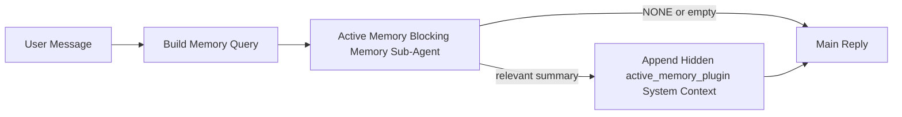

# Active Memory

Active memory is an optional plugin-owned blocking memory sub-agent that runs
before the main reply for eligible conversational sessions.

It exists because most memory systems are capable but reactive. They rely on
the main agent to decide when to search memory, or on the user to say things
like "remember this" or "search memory." By then, the moment where memory would
have made the reply feel natural has already passed.

Active memory gives the system one bounded chance to surface relevant memory
before the main reply is generated.

## Paste This Into Your Agent

Paste this into your agent if you want it to enable Active Memory with a
self-contained, safe-default setup:

```json5
{
  plugins: {
    entries: {
      "active-memory": {
        enabled: true,
        config: {
          enabled: true,
          agents: ["main"],
          allowedChatTypes: ["direct"],
          modelFallback: "google/gemini-3-flash",
          queryMode: "recent",
          promptStyle: "balanced",
          timeoutMs: 15000,
          maxSummaryChars: 220,
          persistTranscripts: false,
          logging: true,
        },
      },
    },
  },
}
```

This turns the plugin on for the `main` agent, keeps it limited to direct-message
style sessions by default, lets it inherit the current session model first, and
uses the configured fallback model only if no explicit or inherited model is
available.

After that, restart the gateway:

```bash
openclaw gateway
```

To inspect it live in a conversation:

```text
/verbose on
```

## Turn active memory on

The safest setup is:

1. enable the plugin
2. target one conversational agent
3. keep logging on only while tuning

Start with this in `openclaw.json`:

```json5
{
  plugins: {
    entries: {
      "active-memory": {
        enabled: true,
        config: {
          agents: ["main"],
          allowedChatTypes: ["direct"],
          modelFallback: "google/gemini-3-flash",
          queryMode: "recent",
          promptStyle: "balanced",
          timeoutMs: 15000,
          maxSummaryChars: 220,
          persistTranscripts: false,
          logging: true,
        },
      },
    },
  },
}
```

Then restart the gateway:

```bash
openclaw gateway
```

What this means:

- `plugins.entries.active-memory.enabled: true` turns the plugin on
- `config.agents: ["main"]` opts only the `main` agent into active memory
- `config.allowedChatTypes: ["direct"]` keeps active memory on for direct-message style sessions only by default
- if `config.model` is unset, active memory inherits the current session model first
- `config.modelFallback` optionally provides your own fallback provider/model for recall
- `config.promptStyle: "balanced"` uses the default general-purpose prompt style for `recent` mode
- active memory still runs only on eligible interactive persistent chat sessions

## How to see it

Active memory injects hidden system context for the model. It does not expose
raw `<active_memory_plugin>...</active_memory_plugin>` tags to the client.

## Session toggle

Use the plugin command when you want to pause or resume active memory for the
current chat session without editing config:

```text
/active-memory status
/active-memory off
/active-memory on
```

This is session-scoped. It does not change
`plugins.entries.active-memory.enabled`, agent targeting, or other global
configuration.

If you want the command to write config and pause or resume active memory for
all sessions, use the explicit global form:

```text
/active-memory status --global
/active-memory off --global
/active-memory on --global
```

The global form writes `plugins.entries.active-memory.config.enabled`. It leaves
`plugins.entries.active-memory.enabled` on so the command remains available to
turn active memory back on later.

If you want to see what active memory is doing in a live session, turn verbose
mode on for that session:

```text
/verbose on
```

With verbose enabled, OpenClaw can show:

- an active memory status line such as `Active Memory: ok 842ms recent 34 chars`
- a readable debug summary such as `Active Memory Debug: Lemon pepper wings with blue cheese.`

Those lines are derived from the same active memory pass that feeds the hidden
system context, but they are formatted for humans instead of exposing raw prompt
markup.

By default, the blocking memory sub-agent transcript is temporary and deleted
after the run completes.

Example flow:

```text
/verbose on
what wings should i order?
```

Expected visible reply shape:

```text
...normal assistant reply...

🧩 Active Memory: ok 842ms recent 34 chars
🔎 Active Memory Debug: Lemon pepper wings with blue cheese.
```

## When it runs

Active memory uses two gates:

1. **Config opt-in**
   The plugin must be enabled, and the current agent id must appear in
   `plugins.entries.active-memory.config.agents`.
2. **Strict runtime eligibility**
   Even when enabled and targeted, active memory only runs for eligible
   interactive persistent chat sessions.

The actual rule is:

```text
plugin enabled
+
agent id targeted
+
allowed chat type
+
eligible interactive persistent chat session
=
active memory runs
```

If any of those fail, active memory does not run.

## Session types

`config.allowedChatTypes` controls which kinds of conversations may run Active
Memory at all.

The default is:

```json5
allowedChatTypes: ["direct"]
```

That means Active Memory runs by default in direct-message style sessions, but
not in group or channel sessions unless you opt them in explicitly.

Examples:

```json5
allowedChatTypes: ["direct"]
```

```json5
allowedChatTypes: ["direct", "group"]
```

```json5
allowedChatTypes: ["direct", "group", "channel"]
```

## Where it runs

Active memory is a conversational enrichment feature, not a platform-wide
inference feature.

| Surface                                                             | Runs active memory?                                     |
| ------------------------------------------------------------------- | ------------------------------------------------------- |
| Control UI / web chat persistent sessions                           | Yes, if the plugin is enabled and the agent is targeted |
| Other interactive channel sessions on the same persistent chat path | Yes, if the plugin is enabled and the agent is targeted |
| Headless one-shot runs                                              | No                                                      |
| Heartbeat/background runs                                           | No                                                      |
| Generic internal `agent-command` paths                              | No                                                      |
| Sub-agent/internal helper execution                                 | No                                                      |

## Why use it

Use active memory when:

- the session is persistent and user-facing
- the agent has meaningful long-term memory to search
- continuity and personalization matter more than raw prompt determinism

It works especially well for:

- stable preferences
- recurring habits
- long-term user context that should surface naturally

It is a poor fit for:

- automation
- internal workers
- one-shot API tasks
- places where hidden personalization would be surprising

## How it works

The runtime shape is:



The blocking memory sub-agent can use only:

- `memory_search`
- `memory_get`

If the connection is weak, it should return `NONE`.

## Query modes

`config.queryMode` controls how much conversation the blocking memory sub-agent sees.

## Prompt styles

`config.promptStyle` controls how eager or strict the blocking memory sub-agent is
when deciding whether to return memory.

Available styles:

- `balanced`: general-purpose default for `recent` mode
- `strict`: least eager; best when you want very little bleed from nearby context
- `contextual`: most continuity-friendly; best when conversation history should matter more
- `recall-heavy`: more willing to surface memory on softer but still plausible matches
- `precision-heavy`: aggressively prefers `NONE` unless the match is obvious
- `preference-only`: optimized for favorites, habits, routines, taste, and recurring personal facts

Default mapping when `config.promptStyle` is unset:

```text
message -> strict
recent -> balanced
full -> contextual
```

If you set `config.promptStyle` explicitly, that override wins.

Example:

```json5
promptStyle: "preference-only"
```

## Model fallback policy

If `config.model` is unset, Active Memory tries to resolve a model in this order:

```text
explicit plugin model
-> current session model
-> agent primary model
-> optional configured fallback model
```

`config.modelFallback` controls the configured fallback step.

Optional custom fallback:

```json5
modelFallback: "google/gemini-3-flash"
```

If no explicit, inherited, or configured fallback model resolves, Active Memory
skips recall for that turn.

`config.modelFallbackPolicy` is retained only as a deprecated compatibility
field for older configs. It no longer changes runtime behavior.

## Advanced escape hatches

These options are intentionally not part of the recommended setup.

`config.thinking` can override the blocking memory sub-agent thinking level:

```json5
thinking: "medium"
```

Default:

```json5
thinking: "off"
```

Do not enable this by default. Active Memory runs in the reply path, so extra
thinking time directly increases user-visible latency.

`config.promptAppend` adds extra operator instructions after the default Active
Memory prompt and before the conversation context:

```json5
promptAppend: "Prefer stable long-term preferences over one-off events."
```

`config.promptOverride` replaces the default Active Memory prompt. OpenClaw
still appends the conversation context afterward:

```json5
promptOverride: "You are a memory search agent. Return NONE or one compact user fact."
```

Prompt customization is not recommended unless you are deliberately testing a
different recall contract. The default prompt is tuned to return either `NONE`
or compact user-fact context for the main model.

### `message`

Only the latest user message is sent.

```text
Latest user message only
```

Use this when:

- you want the fastest behavior
- you want the strongest bias toward stable preference recall
- follow-up turns do not need conversational context

Recommended timeout:

- start around `3000` to `5000` ms

### `recent`

The latest user message plus a small recent conversational tail is sent.

```text
Recent conversation tail:
user: ...
assistant: ...
user: ...

Latest user message:
...
```

Use this when:

- you want a better balance of speed and conversational grounding
- follow-up questions often depend on the last few turns

Recommended timeout:

- start around `15000` ms

### `full`

The full conversation is sent to the blocking memory sub-agent.

```text
Full conversation context:
user: ...
assistant: ...
user: ...
...
```

Use this when:

- the strongest recall quality matters more than latency
- the conversation contains important setup far back in the thread

Recommended timeout:

- increase it substantially compared with `message` or `recent`
- start around `15000` ms or higher depending on thread size

In general, timeout should increase with context size:

```text
message < recent < full
```

## Transcript persistence

Active memory blocking memory sub-agent runs create a real `session.jsonl`
transcript during the blocking memory sub-agent call.

By default, that transcript is temporary:

- it is written to a temp directory
- it is used only for the blocking memory sub-agent run
- it is deleted immediately after the run finishes

If you want to keep those blocking memory sub-agent transcripts on disk for debugging or
inspection, turn persistence on explicitly:

```json5
{
  plugins: {
    entries: {
      "active-memory": {
        enabled: true,
        config: {
          agents: ["main"],
          persistTranscripts: true,
          transcriptDir: "active-memory",
        },
      },
    },
  },
}
```

When enabled, active memory stores transcripts in a separate directory under the
target agent's sessions folder, not in the main user conversation transcript
path.

The default layout is conceptually:

```text
agents/<agent>/sessions/active-memory/<blocking-memory-sub-agent-session-id>.jsonl
```

You can change the relative subdirectory with `config.transcriptDir`.

Use this carefully:

- blocking memory sub-agent transcripts can accumulate quickly on busy sessions
- `full` query mode can duplicate a lot of conversation context
- these transcripts contain hidden prompt context and recalled memories

## Configuration

All active memory configuration lives under:

```text
plugins.entries.active-memory
```

The most important fields are:

| Key                         | Type                                                                                                 | Meaning                                                                                                |
| --------------------------- | ---------------------------------------------------------------------------------------------------- | ------------------------------------------------------------------------------------------------------ |
| `enabled`                   | `boolean`                                                                                            | Enables the plugin itself                                                                              |
| `config.agents`             | `string[]`                                                                                           | Agent ids that may use active memory                                                                   |
| `config.model`              | `string`                                                                                             | Optional blocking memory sub-agent model ref; when unset, active memory uses the current session model |
| `config.queryMode`          | `"message" \| "recent" \| "full"`                                                                    | Controls how much conversation the blocking memory sub-agent sees                                      |
| `config.promptStyle`        | `"balanced" \| "strict" \| "contextual" \| "recall-heavy" \| "precision-heavy" \| "preference-only"` | Controls how eager or strict the blocking memory sub-agent is when deciding whether to return memory   |
| `config.thinking`           | `"off" \| "minimal" \| "low" \| "medium" \| "high" \| "xhigh" \| "adaptive"`                         | Advanced thinking override for the blocking memory sub-agent; default `off` for speed                  |
| `config.promptOverride`     | `string`                                                                                             | Advanced full prompt replacement; not recommended for normal use                                       |
| `config.promptAppend`       | `string`                                                                                             | Advanced extra instructions appended to the default or overridden prompt                               |
| `config.timeoutMs`          | `number`                                                                                             | Hard timeout for the blocking memory sub-agent                                                         |
| `config.maxSummaryChars`    | `number`                                                                                             | Maximum total characters allowed in the active-memory summary                                          |
| `config.logging`            | `boolean`                                                                                            | Emits active memory logs while tuning                                                                  |
| `config.persistTranscripts` | `boolean`                                                                                            | Keeps blocking memory sub-agent transcripts on disk instead of deleting temp files                     |
| `config.transcriptDir`      | `string`                                                                                             | Relative blocking memory sub-agent transcript directory under the agent sessions folder                |

Useful tuning fields:

| Key                           | Type     | Meaning                                                       |
| ----------------------------- | -------- | ------------------------------------------------------------- |
| `config.maxSummaryChars`      | `number` | Maximum total characters allowed in the active-memory summary |
| `config.recentUserTurns`      | `number` | Prior user turns to include when `queryMode` is `recent`      |
| `config.recentAssistantTurns` | `number` | Prior assistant turns to include when `queryMode` is `recent` |
| `config.recentUserChars`      | `number` | Max chars per recent user turn                                |
| `config.recentAssistantChars` | `number` | Max chars per recent assistant turn                           |
| `config.cacheTtlMs`           | `number` | Cache reuse for repeated identical queries                    |

## Recommended setup

Start with `recent`.

```json5
{
  plugins: {
    entries: {
      "active-memory": {
        enabled: true,
        config: {
          agents: ["main"],
          queryMode: "recent",
          promptStyle: "balanced",
          timeoutMs: 15000,
          maxSummaryChars: 220,
          logging: true,
        },
      },
    },
  },
}
```

If you want to inspect live behavior while tuning, use `/verbose on` in the
session instead of looking for a separate active-memory debug command.

Then move to:

- `message` if you want lower latency
- `full` if you decide extra context is worth the slower blocking memory sub-agent

## Debugging

If active memory is not showing up where you expect:

1. Confirm the plugin is enabled under `plugins.entries.active-memory.enabled`.
2. Confirm the current agent id is listed in `config.agents`.
3. Confirm you are testing through an interactive persistent chat session.
4. Turn on `config.logging: true` and watch the gateway logs.
5. Verify memory search itself works with `openclaw memory status --deep`.

If memory hits are noisy, tighten:

- `maxSummaryChars`

If active memory is too slow:

- lower `queryMode`
- lower `timeoutMs`
- reduce recent turn counts
- reduce per-turn char caps

## Related pages

- [Memory Search](/concepts/memory-search)
- [Memory configuration reference](/reference/memory-config)
- [Plugin SDK setup](/plugins/sdk-setup)
