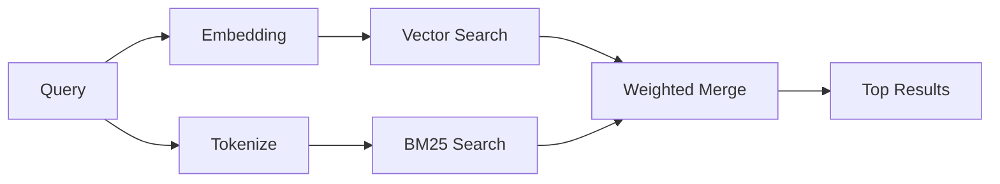

# Memory Search

`memory_search` finds relevant notes from your memory files, even when the
wording differs from the original text. It works by indexing memory into small
chunks and searching them using embeddings, keywords, or both.

## Quick start

If you have an OpenAI, Gemini, Voyage, or Mistral API key configured, memory
search works automatically. To set a provider explicitly:

```json5
{
  agents: {
    defaults: {
      memorySearch: {
        provider: "openai", // or "gemini", "local", "ollama", etc.
      },
    },
  },
}
```

For local embeddings with no API key, use `provider: "local"` (requires
node-llama-cpp).

## Supported providers

| Provider | ID        | Needs API key | Notes                                                |
| -------- | --------- | ------------- | ---------------------------------------------------- |
| OpenAI   | `openai`  | Yes           | Auto-detected, fast                                  |
| Gemini   | `gemini`  | Yes           | Supports image/audio indexing                        |
| Voyage   | `voyage`  | Yes           | Auto-detected                                        |
| Mistral  | `mistral` | Yes           | Auto-detected                                        |
| Bedrock  | `bedrock` | No            | Auto-detected when the AWS credential chain resolves |
| Ollama   | `ollama`  | No            | Local, must set explicitly                           |
| Local    | `local`   | No            | GGUF model, ~0.6 GB download                         |

## How search works

OpenClaw runs two retrieval paths in parallel and merges the results:



- **Vector search** finds notes with similar meaning ("gateway host" matches
  "the machine running OpenClaw").
- **BM25 keyword search** finds exact matches (IDs, error strings, config
  keys).

If only one path is available (no embeddings or no FTS), the other runs alone.

## Improving search quality

Two optional features help when you have a large note history:

### Temporal decay

Old notes gradually lose ranking weight so recent information surfaces first.
With the default half-life of 30 days, a note from last month scores at 50% of
its original weight. Evergreen files like `MEMORY.md` are never decayed.

<Tip>
Enable temporal decay if your agent has months of daily notes and stale
information keeps outranking recent context.
</Tip>

### MMR (diversity)

Reduces redundant results. If five notes all mention the same router config, MMR
ensures the top results cover different topics instead of repeating.

<Tip>
Enable MMR if `memory_search` keeps returning near-duplicate snippets from
different daily notes.
</Tip>

### Enable both

```json5
{
  agents: {
    defaults: {
      memorySearch: {
        query: {
          hybrid: {
            mmr: { enabled: true },
            temporalDecay: { enabled: true },
          },
        },
      },
    },
  },
}
```

## Multimodal memory

With Gemini Embedding 2, you can index images and audio files alongside
Markdown. Search queries remain text, but they match against visual and audio
content. See the [Memory configuration reference](/reference/memory-config) for
setup.

## Session memory search

You can optionally index session transcripts so `memory_search` can recall
earlier conversations. This is opt-in via
`memorySearch.experimental.sessionMemory`. See the
[configuration reference](/reference/memory-config) for details.

## Troubleshooting

**No results?** Run `openclaw memory status` to check the index. If empty, run
`openclaw memory index --force`.

**Only keyword matches?** Your embedding provider may not be configured. Check
`openclaw memory status --deep`.

**CJK text not found?** Rebuild the FTS index with
`openclaw memory index --force`.

## Further reading

- [Active Memory](/concepts/active-memory) -- sub-agent memory for interactive chat sessions
- [Memory](/concepts/memory) -- file layout, backends, tools
- [Memory configuration reference](/reference/memory-config) -- all config knobs
