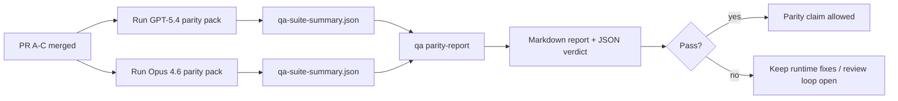

# GPT-5.4 / Codex Parity Maintainer Notes

This note explains how to review the GPT-5.4 / Codex parity program as four merge units without losing the original six-contract architecture.

## Merge units

### PR A: strict-agentic execution

Owns:

- `executionContract`
- GPT-5-first same-turn follow-through
- `update_plan` as non-terminal progress tracking
- explicit blocked states instead of plan-only silent stops

Does not own:

- auth/runtime failure classification
- permission truthfulness
- replay/continuation redesign
- parity benchmarking

### PR B: runtime truthfulness

Owns:

- Codex OAuth scope correctness
- typed provider/runtime failure classification
- truthful `/elevated full` availability and blocked reasons

Does not own:

- tool schema normalization
- replay/liveness state
- benchmark gating

### PR C: execution correctness

Owns:

- provider-owned OpenAI/Codex tool compatibility
- parameter-free strict schema handling
- replay-invalid surfacing
- paused, blocked, and abandoned long-task state visibility

Does not own:

- self-elected continuation
- generic Codex dialect behavior outside provider hooks
- benchmark gating

### PR D: parity harness

Owns:

- first-wave GPT-5.4 vs Opus 4.6 scenario pack
- parity documentation
- parity report and release-gate mechanics

Does not own:

- runtime behavior changes outside QA-lab
- auth/proxy/DNS simulation inside the harness

## Mapping back to the original six contracts

| Original contract                        | Merge unit |
| ---------------------------------------- | ---------- |
| Provider transport/auth correctness      | PR B       |
| Tool contract/schema compatibility       | PR C       |
| Same-turn execution                      | PR A       |
| Permission truthfulness                  | PR B       |
| Replay/continuation/liveness correctness | PR C       |
| Benchmark/release gate                   | PR D       |

## Review order

1. PR A
2. PR B
3. PR C
4. PR D

PR D is the proof layer. It should not be the reason runtime-correctness PRs are delayed.

## What to look for

### PR A

- GPT-5 runs act or fail closed instead of stopping at commentary
- `update_plan` no longer looks like progress by itself
- behavior stays GPT-5-first and embedded-Pi scoped

### PR B

- auth/proxy/runtime failures stop collapsing into generic “model failed” handling
- `/elevated full` is only described as available when it is actually available
- blocked reasons are visible to both the model and the user-facing runtime

### PR C

- strict OpenAI/Codex tool registration behaves predictably
- parameter-free tools do not fail strict schema checks
- replay and compaction outcomes preserve truthful liveness state

### PR D

- the scenario pack is understandable and reproducible
- the pack includes a mutating replay-safety lane, not only read-only flows
- reports are readable by humans and automation
- parity claims are evidence-backed, not anecdotal

Expected artifacts from PR D:

- `qa-suite-report.md` / `qa-suite-summary.json` for each model run
- `qa-agentic-parity-report.md` with aggregate and scenario-level comparison
- `qa-agentic-parity-summary.json` with a machine-readable verdict

## Release gate

Do not claim GPT-5.4 parity or superiority over Opus 4.6 until:

- PR A, PR B, and PR C are merged
- PR D runs the first-wave parity pack cleanly
- runtime-truthfulness regression suites remain green
- the parity report shows no fake-success cases and no regression in stop behavior

The parity harness is not the only evidence source. Keep this split explicit in review:

- PR D owns the scenario-based GPT-5.4 vs Opus 4.6 comparison
- PR B deterministic suites still own auth/proxy/DNS and full-access truthfulness evidence

## Goal-to-evidence map

| Completion gate item                     | Primary owner | Review artifact                                                     |
| ---------------------------------------- | ------------- | ------------------------------------------------------------------- |
| No plan-only stalls                      | PR A          | strict-agentic runtime tests and `approval-turn-tool-followthrough` |
| No fake progress or fake tool completion | PR A + PR D   | parity fake-success count plus scenario-level report details        |
| No false `/elevated full` guidance       | PR B          | deterministic runtime-truthfulness suites                           |
| Replay/liveness failures remain explicit | PR C + PR D   | lifecycle/replay suites plus `compaction-retry-mutating-tool`       |
| GPT-5.4 matches or beats Opus 4.6        | PR D          | `qa-agentic-parity-report.md` and `qa-agentic-parity-summary.json`  |

## Reviewer shorthand: before vs after

| User-visible problem before                                 | Review signal after                                                                     |
| ----------------------------------------------------------- | --------------------------------------------------------------------------------------- |
| GPT-5.4 stopped after planning                              | PR A shows act-or-block behavior instead of commentary-only completion                  |
| Tool use felt brittle with strict OpenAI/Codex schemas      | PR C keeps tool registration and parameter-free invocation predictable                  |
| `/elevated full` hints were sometimes misleading            | PR B ties guidance to actual runtime capability and blocked reasons                     |
| Long tasks could disappear into replay/compaction ambiguity | PR C emits explicit paused, blocked, abandoned, and replay-invalid state                |
| Parity claims were anecdotal                                | PR D produces a report plus JSON verdict with the same scenario coverage on both models |
