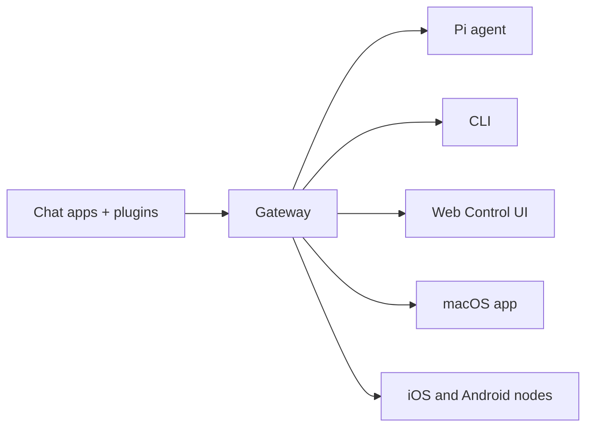

# OpenClaw 🦞

<p align="center">
    
    
</p>

> _"EXFOLIATE! EXFOLIATE!"_ — A space lobster, probably

<p align="center">
  <strong>Any OS gateway for AI agents across Discord, Google Chat, iMessage, Matrix, Microsoft Teams, Signal, Slack, Telegram, WhatsApp, Zalo, and more.</strong><br />
  Send a message, get an agent response from your pocket. Run one Gateway across built-in channels, bundled channel plugins, WebChat, and mobile nodes.
</p>

<Columns>
  <Card title="Get Started" href="/start/getting-started" icon="rocket">
    Install OpenClaw and bring up the Gateway in minutes.
  </Card>
  <Card title="Run Onboarding" href="/start/wizard" icon="sparkles">
    Guided setup with `openclaw onboard` and pairing flows.
  </Card>
  <Card title="Open the Control UI" href="/web/control-ui" icon="layout-dashboard">
    Launch the browser dashboard for chat, config, and sessions.
  </Card>
</Columns>

## What is OpenClaw?

OpenClaw is a **self-hosted gateway** that connects your favorite chat apps and channel surfaces — built-in channels plus bundled or external channel plugins such as Discord, Google Chat, iMessage, Matrix, Microsoft Teams, Signal, Slack, Telegram, WhatsApp, Zalo, and more — to AI coding agents like Pi. You run a single Gateway process on your own machine (or a server), and it becomes the bridge between your messaging apps and an always-available AI assistant.

**Who is it for?** Developers and power users who want a personal AI assistant they can message from anywhere — without giving up control of their data or relying on a hosted service.

**What makes it different?**

- **Self-hosted**: runs on your hardware, your rules
- **Multi-channel**: one Gateway serves built-in channels plus bundled or external channel plugins simultaneously
- **Agent-native**: built for coding agents with tool use, sessions, memory, and multi-agent routing
- **Open source**: MIT licensed, community-driven

**What do you need?** Node 24 (recommended), or Node 22 LTS (`22.14+`) for compatibility, an API key from your chosen provider, and 5 minutes. For best quality and security, use the strongest latest-generation model available.

## How it works



The Gateway is the single source of truth for sessions, routing, and channel connections.

## Key capabilities

<Columns>
  <Card title="Multi-channel gateway" icon="network">
    Discord, iMessage, Signal, Slack, Telegram, WhatsApp, WebChat, and more with a single Gateway process.
  </Card>
  <Card title="Plugin channels" icon="plug">
    Bundled plugins add Matrix, Nostr, Twitch, Zalo, and more in normal current releases.
  </Card>
  <Card title="Multi-agent routing" icon="route">
    Isolated sessions per agent, workspace, or sender.
  </Card>
  <Card title="Media support" icon="image">
    Send and receive images, audio, and documents.
  </Card>
  <Card title="Web Control UI" icon="monitor">
    Browser dashboard for chat, config, sessions, and nodes.
  </Card>
  <Card title="Mobile nodes" icon="smartphone">
    Pair iOS and Android nodes for Canvas, camera, and voice-enabled workflows.
  </Card>
</Columns>

## Quick start

<Steps>
  <Step title="Install OpenClaw">
    ```bash
    npm install -g openclaw@latest
    ```
  </Step>
  <Step title="Onboard and install the service">
    ```bash
    openclaw onboard --install-daemon
    ```
  </Step>
  <Step title="Chat">
    Open the Control UI in your browser and send a message:

    ```bash
    openclaw dashboard
    ```

    Or connect a channel ([Telegram](/channels/telegram) is fastest) and chat from your phone.

  </Step>
</Steps>

Need the full install and dev setup? See [Getting Started](/start/getting-started).

## Dashboard

Open the browser Control UI after the Gateway starts.

- Local default: [http://127.0.0.1:18789/](http://127.0.0.1:18789/)
- Remote access: [Web surfaces](/web) and [Tailscale](/gateway/tailscale)

<p align="center">
  
</p>

## Configuration (optional)

Config lives at `~/.openclaw/openclaw.json`.

- If you **do nothing**, OpenClaw uses the bundled Pi binary in RPC mode with per-sender sessions.
- If you want to lock it down, start with `channels.whatsapp.allowFrom` and (for groups) mention rules.

Example:

```json5
{
  channels: {
    whatsapp: {
      allowFrom: ["+15555550123"],
      groups: { "*": { requireMention: true } },
    },
  },
  messages: { groupChat: { mentionPatterns: ["@openclaw"] } },
}
```

## Start here

<Columns>
  <Card title="Docs hubs" href="/start/hubs" icon="book-open">
    All docs and guides, organized by use case.
  </Card>
  <Card title="Configuration" href="/gateway/configuration" icon="settings">
    Core Gateway settings, tokens, and provider config.
  </Card>
  <Card title="Remote access" href="/gateway/remote" icon="globe">
    SSH and tailnet access patterns.
  </Card>
  <Card title="Channels" href="/channels/telegram" icon="message-square">
    Channel-specific setup for Feishu, Microsoft Teams, WhatsApp, Telegram, Discord, and more.
  </Card>
  <Card title="Nodes" href="/nodes" icon="smartphone">
    iOS and Android nodes with pairing, Canvas, camera, and device actions.
  </Card>
  <Card title="Help" href="/help" icon="life-buoy">
    Common fixes and troubleshooting entry point.
  </Card>
</Columns>

## Learn more

<Columns>
  <Card title="Full feature list" href="/concepts/features" icon="list">
    Complete channel, routing, and media capabilities.
  </Card>
  <Card title="Multi-agent routing" href="/concepts/multi-agent" icon="route">
    Workspace isolation and per-agent sessions.
  </Card>
  <Card title="Security" href="/gateway/security" icon="shield">
    Tokens, allowlists, and safety controls.
  </Card>
  <Card title="Troubleshooting" href="/gateway/troubleshooting" icon="wrench">
    Gateway diagnostics and common errors.
  </Card>
  <Card title="About and credits" href="/reference/credits" icon="info">
    Project origins, contributors, and license.
  </Card>
</Columns>
